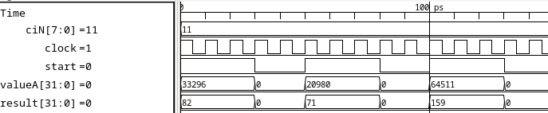

# Grayscale conversion 
##### Filippo Quadri (329487) & Vincent Roduit (325140)

The verilog description of the grayscale converter module (`rgb565GrayscaleIse.v`) can be found in the folder `systems/singleCore/verilog`.
We've also modified the file `or1420SingleCore.v` in the same folder (to instantiate the module).

The file `grayscale.c`, that can be found in the folder `programms/grayscale/src`, also presents some modifications.

Here we present the results of our simulations

**The grayscale custom module**
As you can see in this snippet from the TB we created, the computation is completed in less than one clock cycle, as requested.

**Without custom grayscale module**
| Type    | Frame 1 | Frame 2 | Frame 3 | Mean|
| -------- | ------- | ------- | ------- | ------- |
| CPU Cycles  | 30'731'864    | 30'686'545 | 30'686'500 | 30'701'636
| Stall Cycles | 19'051'517    | 19'006'198 | 19'006'153 | 19'021'289
| Bus Idle Cycles    | 16'929'948   | 16'931'312 | 16'931'301 | 16'930'853

**With custom grayscale module**
| Type    | Frame 1 | Frame 2 | Frame 3 | Mean|
| -------- | ------- | ------- | ------- | ------- |
| CPU Cycles  | 24'496'296    | 24'533'821 | 24'547'507 | 24'525'874
| Stall Cycles | 18'345'549     | 18'383'074 | 18'396760 | 18'375'127
| Bus Idle Cycles    | 11'560'994    | 11'560'410 | 11'560'133 | 11'560'512

**Conclusion**
The integration of this custom gate significantly optimizes CPU cycles and minimizes bus idle, effectively improving resource utilization. Although there's a slight decrease in stall cycles, this improvement is somewhat limited. This limitation might be attributed to the fact that the previous implementation didn't induce CPU too much in a stall conditions. Additionally, since the custom instruction we implemented consists solely of combinatory logic, it doesn't introduce any extra stall time.