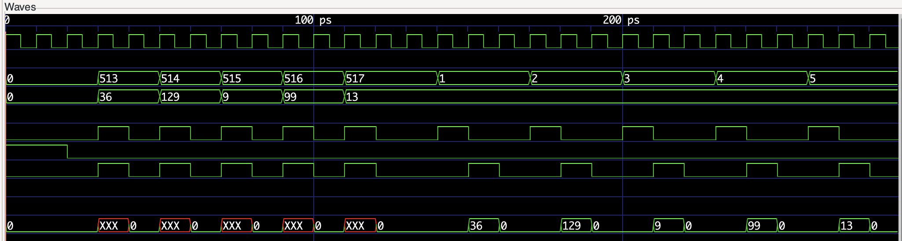
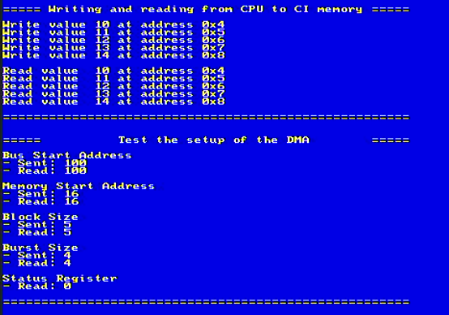
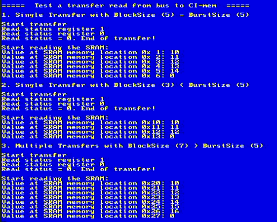
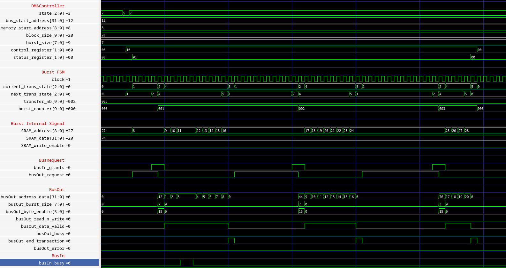
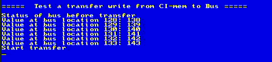

# CS-476: Embedded Systems Design
## PW4: Built-in Peripheral DMA Controller

### Part 1
The purpose of the first task was to construct a skeleton for the DMA-attached memory. In order to test the functionalities of the module, a testbench was created. The code for this testbench can be found under `part1/virtual_prototype/verilog/ramDmaCi_tb.v`. A .gtkw file is also provided with all the interesting signals nicely ordered. This file can be found under: `part1/virtual_prototype/verilog/part1.gtkw`. This testbench performs write operations initiated by the CPU to a memory. After that, it reads the same memory locations.



This first testbench can be decomposed into three phases. 
- During the first phase, the module is reset, and all signals are set to zero. 
- The second phase consists of multiple write operations. The done signal is set to 1 at the same time as the start signal. Values 36, 129, 9, 99, and 13 are written at addresses from 1 to 5. 
- The third phase consists of reading the same addresses that were written in phase 2. The result gives the corresponding values with a 1-cycle delay. Furthermore, the done signal is raised one cycle after the done signal. The proper function of the module is then demonstrated. \
The figure below shows the proper functionality of this first part. Writing at different values works, as the system is able to read those values afterwards. In order to test this part, the variable `TEST_RW_CPU` (in the file `./part2/virtual_prototype/programms/helloWorld/src/hello.c`) has to be set to 1. Furthermore, this figure shows the implementation of the setup for the DMA controller (for part 2). Again, to test this part, the variable `TEST_DMA_SETUP` can be set to 1.



### Part 2
In this second part, the DMA controller is implemented. Writing from the bus to the SRAM should be possible. At first glance, a testbench is implemented to verify the functionality of this module. This testbench can be found under `./part2/virtual_prototype/systems/singleCore/verilog/ramDmaCi_tb.v`. First of all, the DMA has to be set (i.e., the block size, the burst size, etc.). When all those registers are set, the write operation can start. Again, code written in C (`./part2/virtual_prototype/programms/helloWorld/src/hello.c`) is provided and shows that the write operation works. This code shows that only values are stored in the first addresses, i.e. when trying reading a value from an address that was not set previously, an undetermined value is returned. \
As already stated in the paragraph below, the setup of the DMA works well. In addition to this setup, various tests are implemented in the `hello.c`. First of all, an array is defined in order to test the read (and write) functionalities. This array is instantiate as follow:
```C
  uint32_t arraySize = 512;
  volatile uint32_t memoryArray[512];
  for (uint32_t i = 0 ; i < arraySize ; i++) {
    memoryArray[i] = swap_u32(i+10);
  }
```
#### First test - Single transfer

The first test implemented consists of a single transfer. The config of the DMA for this operation is shown in the box below.
```
 Config of the transfer
 - Memory Start Address: 0x1
 - Bus Start Address: 0x7ff7d0 (=&memoryArray[0])
 - Block Size: 5
 - Burst Size (+1): 5
 - Nb of transfers: 1
 ```
Looking at the address 0x6 in the image below, one can see that the burst stops at the right time and don't write other at other addresses.

#### Second test - Single transfer with block size < burst size
The second test shows functionnality when the block size is smaller than the burst size. In this case, the burst should be stopped before the burst size. As we can see from address location 0x13, nothing was written at this address. Again, the DMA config is shown in the box below.
```
 Config of the transfer
 - Memory Start Address: 0x10
 - Bus Start Address: 0x7ff7d0 (=&memoryArray[0])
 - Block Size: 3
 - Burst Size (+1): 5
 - Nb of transfers: 1
```

#### Third test - Multiple transfer
The config is shown in the box. As we can see in the picture below, the right amount of values has been written to the corresponding, showcasing the proper functionnality of the read operations.
```
Config of the transfer
- Memory Start Address: 0x20
- Bus Start Address: 0x7ff7d0
- Block Size: 7
- Burst Size (+1): 5
- Nb of transfers: 2
```




### Part 3
The last part consists of writing from the SRAM to the bus. A testbench (The same as stated in part 2) shows the functionality of this part. Nevertheless, it has shown some difficulties when downloaded on the board. We expect an error on a condition involving the `busIn_busy signal`. When forcing the system to ignore the busy signal, the program managed to end. But with this busy signal, it enters a deadlock sequence and therefore cannot perform the write operation. This behavior can be observed using the same code as stated in part two and set the control register to 0x02.



The image of the testbench shows that the behavior in simulation corresponds to our expectations.
After several days of trying to debug this part, no solution has been found. It can also come from the fact that the testbench that we implemented does not fit perfectly the behavior of the real system and might explain the observed differences. 
This phenomenum is presented in the picture below, where it can be seen that the transfer never ends.



